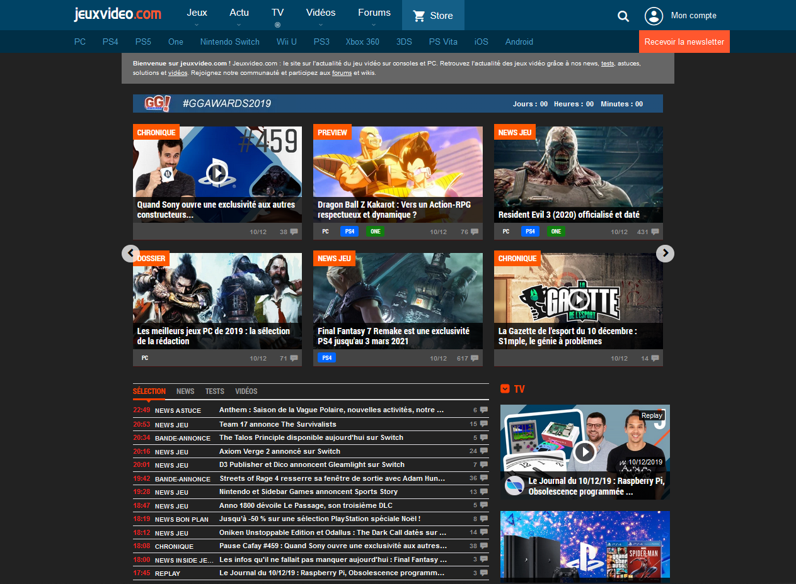

# JVC dark theme
Theme Sombre pour jeuxvideo.com

 

## Installation
### Requis
Stylus pour [Firefox](https://addons.mozilla.org/en-US/firefox/addon/styl-us/), [Chrome](https://chrome.google.com/webstore/detail/stylus/clngdbkpkpeebahjckkjfobafhncgmne) ou [Opera](https://addons.opera.com/en-gb/extensions/details/stylus/)
### A telecharger
 [Lien direct](https://raw.githubusercontent.com/ChevalierSoft/jvc_dark_theme/master/jvc_dark_theme.user.css) 
 [Lien userstyles.org](https://userstyles.org/styles/178159/) 
